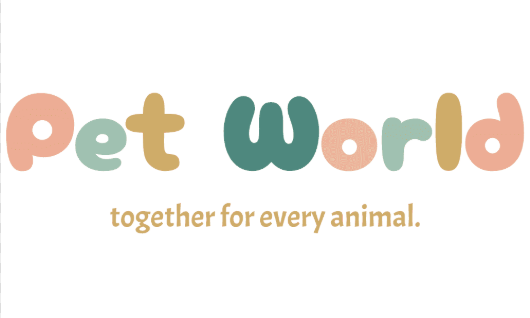

<h1 align="center">
  <br/>
  🐾 Animora
</h1>

<p align="center">
  <em>A full-stack pet welfare platform — adoption, rescue, marketplace, vet services, donations & more</em>
</p>

<p align="center">
  
  
  
  
  
</p>

---

## 📖 Overview

**Animora** is a full-stack PHP web application that serves as a one-stop hub for pet welfare. It connects pet lovers, adopters, volunteers, veterinarians, pet care providers, and product suppliers on a single platform — with role-based dashboards tailored to each user type.

The app is built with **vanilla PHP** (MVC-inspired architecture), **MySQL**, **Tailwind CSS v4**, and features custom animations, a walking-cat navbar mascot, and a rich, responsive UI.

---

## ✨ Features

### 🐶 Pet Adoption
- Browse all pets available for adoption with breed, age & image filters
- Submit adoption applications with a detailed form
- Post your own pet for adoption with photo upload
- Admin approval workflow for adoption posts
- Applicant management (approve / decline applications)

### 🚨 Rescue & Volunteer System
- Volunteers can browse available rescue missions
- Accept and update rescue mission statuses
- Volunteer leaderboard (top contributors)
- Volunteer dashboard with active & completed missions

### 🛒 Marketplace
- Full product listing with categories and details
- Shopping cart with quantity management
- Checkout and order processing
- Supplier dashboard: add, manage & delete products
- Order management for suppliers
- User profile page with purchase history

### 🏥 Veterinary Services
- Browse available vets and their specialties
- Book vet appointments with slot availability check
- View, manage, and track your bookings
- Vet dashboard: manage appointments & send messages
- Vet slot scheduling system

### ✂️ Grooming Services
- Browse and book grooming services
- Service confirmation flow

### 💰 Donations & Fundraising
- Donate to animal welfare causes
- Create and manage fundraising campaigns

### 💬 Messaging
- In-platform messaging between users and vets

### 👤 Multi-Role User System

| Role | Key Pages |
|------|-----------|
| **User** | Home, Adoption, Marketplace, Vet Booking, Grooming, Add Pet |
| **Admin** | Dashboard, User Management, Post Approvals |
| **Volunteer** | Dashboard, Available Missions, My Missions, Leaderboard |
| **Vet** | Dashboard, Appointments, Slot Management, Messages |
| **Pet Care Provider** | Service Home |
| **Supplier** | Dashboard, Add Product, Manage Products, Orders |

---

## 🏗️ Project Structure

```
Animora/
├── index.php                        # Landing page (home)
├── .gitignore
│
├── config/
│   ├── db.php                       # MySQL connection
│   └── constants.php                # App-wide constants
│
├── auth/                            # Auth pages (outside MVC)
│   ├── login.php
│   ├── register.php
│   └── logout.php
│
├── user/                            # User-facing pages
│   ├── user-home.php
│   ├── user-adoption.php            # Browse pets for adoption
│   ├── user-add-pet.php             # Post a pet for adoption
│   ├── post-adoption.php            # Adoption application form
│   ├── submit-adoption.php
│   ├── process-adoption.php
│   ├── process-approve.php
│   ├── process-decline.php
│   ├── marketplacehome.php
│   ├── marketplace-all-product.php
│   ├── marketplace-product-details.php
│   ├── marketplace-cart.php
│   ├── marketplace-profile.php
│   ├── service-home.php
│   ├── service-book.php
│   ├── service-booking-process.php
│   ├── user-grooming-services.php
│   ├── user-vet-appoint-book.php
│   ├── user-vet-appoint-view.php
│   ├── user-article.php
│   ├── fetch_breeds.php             # AJAX: dynamic breed dropdown
│   ├── get_available_slots.php      # AJAX: vet slot availability
│   └── add-animal.php
│
├── admin/                           # Admin panel
│   ├── admin-dashboard.php
│   ├── admin-user-management.php
│   └── admin-post-approve.php
│
├── vet/                             # Vet panel
│   ├── vet-dashboard.php
│   ├── vet-appointment.php
│   ├── vet-manage-slots.php
│   └── vet-message.php
│
├── volunteer/                       # Volunteer panel
│   ├── volunteer-dashboard.php
│   ├── volunteer-available-mission.php
│   ├── volunteer-mission.php
│   ├── volunteer-top-list.php
│   ├── volunteer-accept-mission.php
│   └── volunteer-update-mission-status.php
│
├── marketplace/                     # Supplier panel
│   ├── product-supply-dashboard.php
│   ├── product-supply-addprod.php
│   ├── product-supply-order.php
│   ├── all-products.php
│   └── delete-product.php
│
├── services/                        # Pet care provider
│   └── service-home.php
│
├── controllers/                     # MVC Controllers
│   ├── auth/
│   ├── adoption/
│   ├── rescue/
│   ├── marketplace/
│   ├── services/
│   ├── donations/
│   ├── messaging/
│   └── dashboard/
│
├── models/                          # MVC Models
│   ├── User.php
│   ├── Pet.php
│   ├── Product.php
│   ├── Order.php
│   ├── Cart.php
│   ├── Service.php
│   ├── Rescue.php
│   └── Donation.php
│
├── views/                           # Shared views/partials
│   ├── auth/
│   ├── dashboard/
│   └── includes/                   # header, navbar, footer
│
├── routes/
│   └── web.php
│
├── middleware/
│   └── authMiddleware.php
│
├── assets/
│   ├── css/
│   │   ├── style.css
│   │   ├── user_home.css
│   │   └── input.css               # Tailwind source
│   ├── js/
│   └── images/
│
├── uploads/                         # User-uploaded files
├── package.json                     # Tailwind CSS v4 via npm
└── package-lock.json
```

---

## 🚀 Getting Started

### Prerequisites

- **PHP 8.0+**
- **MySQL / MariaDB**
- A local server environment: [XAMPP](https://www.apachefriends.org/), [Laragon](https://laragon.org/), or [WAMP](https://www.wampserver.com/)
- **Node.js** (optional — only needed to recompile Tailwind CSS)

### Installation

1. **Clone the repository**
   ```bash
   git clone https://github.com/hasinishraq/Animora.git
   cd Animora
   ```

2. **Move to your server web root**
   - XAMPP: `C:/xampp/htdocs/Animora`
   - Laragon: `C:/laragon/www/Animora`

3. **Create the database**
   - Open **phpMyAdmin** and create a database named `animora`
   - Import the SQL schema file (if provided in the repo)

4. **Configure the database connection**

   Open `config/db.php` and update:
   ```php
   $host = 'localhost';
   $db   = 'animora';
   $user = 'root';
   $pass = '';
   ```

5. **(Optional) Compile Tailwind CSS**
   ```bash
   npm install
   npx tailwindcss -i ./assets/css/input.css -o ./assets/css/output.css --watch
   ```

6. **Start the app**
   - Start Apache & MySQL in your server control panel
   - Visit: `http://localhost/Animora`

---

## 🛠️ Tech Stack

| Layer | Technology |
|-------|------------|
| **Backend** | PHP 8+ |
| **Database** | MySQL (via MySQLi) |
| **Frontend** | HTML5, Tailwind CSS v4, Vanilla JS |
| **Fonts** | Google Fonts — Fredoka, Nunito |
| **Architecture** | MVC-inspired |
| **Auth** | PHP Sessions with middleware |

---

## 🤝 Contributing

Contributions are welcome!

1. Fork the repository
2. Create a branch: `git checkout -b feature/your-feature`
3. Commit your changes: `git commit -m "Add: your feature"`
4. Push and open a Pull Request

---

## 📄 License

This project is licensed under the [MIT License](LICENSE).

---

<p align="center">Made with ❤️ for animals everywhere 🐾</p>
